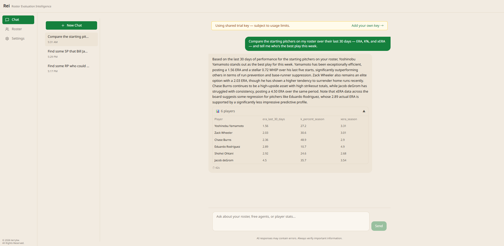
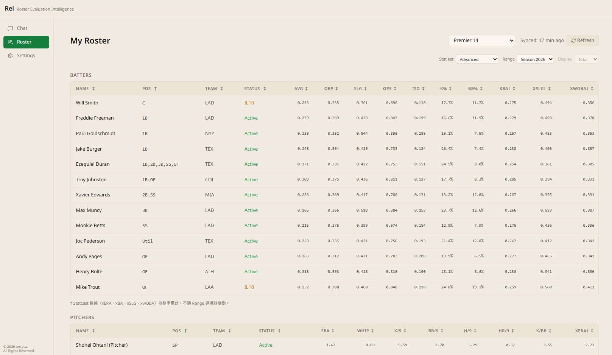
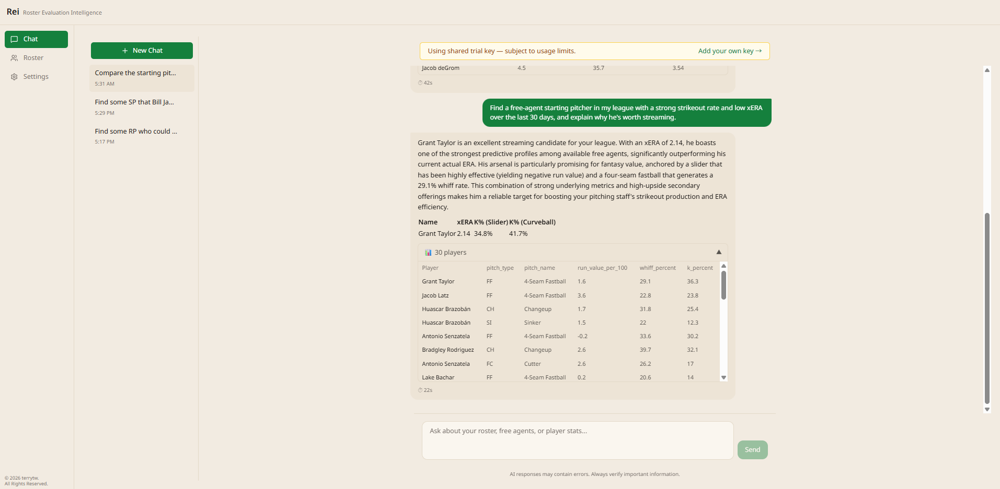
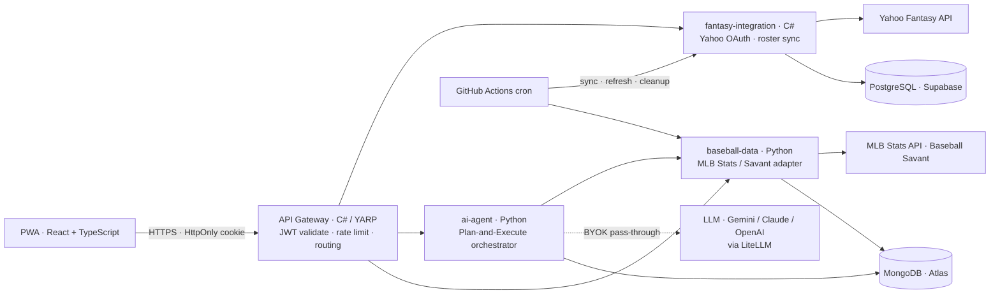

# Rei — Roster Evaluation Intelligence

> A distributed **Fantasy Baseball AI agent** that answers natural-language roster
> questions — "who should I drop for a streaming starter this week?" — by planning a
> chain of tool calls across live MLB data, your Yahoo leagues, and an LLM of your choice.

**Live:** **<https://rei.ttwdev.com>** · BYOK (bring your own LLM key) or try as a guest.

> ⏱️ **Heads-up — cold start.** The backend runs on a $0 free tier and sleeps after
> ~15 min idle, so the **first** request after a while can take ~1 minute to wake
> (you may see a "server is waking up" hint). Subsequent requests are fast. This is a
> deliberate cost trade-off, not a bug — see [How it's deployed](#how-its-deployed).

---

## What it does (user's view)

Rei is a chat-first assistant for Fantasy Baseball managers.

1. **Sign in with Yahoo** (read-only) or continue as a **guest**. Rei pulls in *all*
   your leagues and rosters in one sync.
2. **Ask in plain language.** "Compare my two closers on last-30-day xwOBA",
   "find a free-agent starter with a good matchup tomorrow", "is this hitter breaking out?"
3. **Get an analyst-style answer** streamed back token-by-token, with an inline
   **stat table** for the players involved — sortable, with Basic / Advanced / Statcast-
   percentile columns and Season / Last-30-day / custom date ranges.
4. **Keep multiple chats.** Each conversation is its own session with history.

| Roster & leagues | Chat + inline tables |
|---|---|
|  |  |

**Your keys, your data.** Rei runs in **Advisory Mode**: your LLM API key lives only in
your browser and is passed through per request — **never stored** on the server. The
Yahoo connection is **read-only** (`fspt-r`), encrypted at rest, and you can disconnect
at any time. See [Privacy & trust](#privacy--trust).

---

## How it works (architecture)

Rei is a small **distributed system** — six services, three managed data stores — built
to exercise real backend concerns (auth, rate limiting, caching, resilience, observability)
rather than a single monolith.

### The AI agent — Plan-and-Execute

Instead of a step-by-step ReAct loop (which gets unstable past ~5 steps), Rei's agent
first asks the LLM to **plan** a full chain of tool calls, **validates** every tool name
against a registry (unknown tools are dropped, never hallucinated), executes steps —
in parallel where independent — and then **synthesizes** an answer that explicitly states
which dimensions had data and which didn't. A typical roster question fans out to 6–10
tool calls. The agent reaches live data **only** through ~18 predefined, typed tools, so
it can't invent numbers.

### Notable engineering

- **Multi-language, multi-store by design** — C# for the gateway and Yahoo integration,
  Python for the data and AI services; **PostgreSQL** (relational: users, leagues, auth),
  **MongoDB** (document: chat history + flexible player stats), **Redis** (MQ + rate-limit
  counters). Each choice is matched to its data shape.
- **Auth done properly** — Yahoo OAuth is exchanged for a **Rei-signed JWT** (Token
  Exchange), delivered as an **HttpOnly cookie** with silent **access/refresh rotation**;
  the gateway validates locally with zero round-trips. Guests get a server-issued
  anonymous JWT.
- **Resilience & caching** — circuit breakers on external APIs, a read-through MongoDB
  cache for stats, and stale-while-revalidate on rosters.
- **Observability** — Prometheus metrics + Grafana dashboards across every service.

### How it's deployed

The whole thing runs at **$0**. Render's free tier pools 750 instance-hours/month across
the *entire* workspace, so an always-on fleet is impossible. Rei instead uses a **static
PWA** (CDN, never sleeps) + **scale-to-zero** Docker backends (they burn hours only while
serving), and **moves the always-on scheduler's jobs to GitHub Actions cron**. A
**custom domain** (`rei.` + `rei-api.` under one registrable domain) keeps the auth cookie
first-party so it works in Safari/Firefox. Releases are **tag-driven** — pushing a `v*`
tag builds the images and fires pinned Render deploy hooks. The single accepted trade-off
is the **cold start** above.

---

## Tech stack

| Layer | Choice |
|---|---|
| Frontend | React + TypeScript PWA · Tailwind · TanStack Query |
| API Gateway | C# ASP.NET Core · YARP reverse proxy |
| Services | C# (fantasy-integration) · Python (ai-agent, baseball-data) |
| AI | LiteLLM → Gemini / Claude / OpenAI (BYOK) · Plan-and-Execute |
| Data | PostgreSQL (Supabase) · MongoDB (Atlas) · Redis (Upstash) |
| Infra | Docker · Render · GitHub Actions CD + cron · Cloudflare DNS · Let's Encrypt |
| Observability | Prometheus · Grafana · Serilog / structlog |

---

## Privacy & trust

The source repo is private, so trust is built on things you can **verify yourself**, not
on "read my code":

- **Yahoo is read-only.** Rei requests the `fspt-r` scope only — it can read your leagues
  and rosters, never write or trade. The OAuth token is encrypted at rest, and
  **Disconnect Yahoo** removes it.
- **Your LLM key never leaves your control.** In Advisory Mode the key is held in your
  browser's local storage and sent per request as a pass-through header — it is **not**
  persisted server-side, and it's redacted from all logs. You can confirm this in your
  browser's dev tools.
- **Guest mode** needs no account and shares nothing beyond the questions you ask.

---

## Status

**Advisory Mode MVP** in production — see the **release badge** above and the
[CHANGELOG](CHANGELOG.md) for what shipped in the current version and known
limitations. Roadmap: Agentic mode (opt-in automated add/drop), saved tables,
watchlist UI.

> Known issues / outages are posted as a
> [pinned issue](https://github.com/terrytwchen/Rei-Demo/issues) here, not in this README.

## License

View-only portfolio license — see [LICENSE](LICENSE). Source code available on request.
